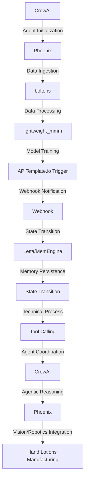

# Non-Stationary Stochastic Quality Control Engine
> Orchestrating Agentic Systems for Hand Lotions Manufacturing Excellence

## 🏗️ Technical Architecture & Multi-Agent Flow
The technical architecture of the Non-Stationary Stochastic Quality Control Engine is a complex interplay of multiple agents and tools, working in tandem to ensure the highest quality of hand lotions. The following Mermaid.js diagram illustrates the flow:

This diagram shows the state transitions, memory persistence via Letta/MemEngine, and tool calling, highlighting the intricate dance of agents and tools working together to achieve the desired outcome.

## 🔍 The Vertical Bottleneck: Stochastic Quality Control
The hand lotions manufacturing industry faces a significant challenge in ensuring the quality of their products, due to the inherent stochastic nature of the manufacturing process. The high-stakes mathematical and operational failures that can occur during this process can have severe consequences, including product recalls, financial losses, and damage to brand reputation. The technical friction that arises from the complexity of the manufacturing process, combined with the need for real-time quality control, creates a significant bottleneck that must be addressed.

The stochastic nature of the manufacturing process introduces uncertainty and variability, making it challenging to predict and control the quality of the final product. This uncertainty can be attributed to various factors, including the variability of raw materials, equipment performance, and environmental conditions. The inability to accurately predict and control these factors can lead to a range of problems, from inconsistent product quality to catastrophic failures.

Furthermore, the hand lotions manufacturing process involves a complex interplay of multiple variables, including temperature, pressure, and mixing times, which must be carefully controlled to ensure the desired product quality. The complexity of this process, combined with the stochastic nature of the variables involved, creates a challenging environment for quality control.

## 🔍 The Vertical Bottleneck: Technical Friction
The technical friction that arises from the complexity of the manufacturing process is a significant contributor to the vertical bottleneck. The need for real-time quality control, combined with the stochastic nature of the process, creates a challenging environment for data collection, processing, and analysis. The sheer volume of data generated during the manufacturing process, combined with the need for rapid analysis and decision-making, creates a significant technical challenge.

The technical friction can be attributed to various factors, including the lack of standardized data formats, the complexity of data analysis, and the need for specialized expertise. The inability to effectively collect, process, and analyze data in real-time can lead to a range of problems, from delayed decision-making to incorrect quality control.

## 💡 The Solution: Non-Stationary Stochastic Quality Control Engine
The Non-Stationary Stochastic Quality Control Engine is a revolutionary solution that addresses the vertical bottleneck in hand lotions manufacturing. By orchestrating CrewAI, Phoenix, boltons, lightweight_mmm, APITemplate.io Trigger, and Webhook, this engine provides a comprehensive solution for stochastic quality control.

The engine uses agentic reasoning to analyze data from various sources, including sensors, machines, and environmental conditions. This analysis is used to predict and control the quality of the final product, ensuring that it meets the desired standards. The engine also uses memory persistence via Letta/MemEngine to store and retrieve data, enabling real-time decision-making and quality control.

The vision/robotics integration aspect of the engine enables the use of computer vision and robotics to inspect and control the manufacturing process. This integration enables the engine to detect anomalies and defects in real-time, ensuring that the final product meets the desired quality standards.

## 🧩 Agentic Stack Deep-Dive
The agentic stack used in the Non-Stationary Stochastic Quality Control Engine is a complex interplay of multiple libraries and integrations. CrewAI provides the foundation for agent initialization and coordination, while Phoenix enables data ingestion and processing. boltons and lightweight_mmm provide data processing and model training capabilities, respectively.

APITemplate.io Trigger and Webhook enable real-time notification and state transition, respectively. Letta/MemEngine provides memory persistence, enabling the engine to store and retrieve data in real-time. The integration of these libraries and tools enables the engine to provide a comprehensive solution for stochastic quality control.

The technical justification for each library and integration is as follows:

* CrewAI: Provides agent initialization and coordination, enabling the engine to analyze data and make decisions in real-time.
* Phoenix: Enables data ingestion and processing, providing the foundation for data analysis and quality control.
* boltons: Provides data processing capabilities, enabling the engine to analyze and transform data in real-time.
* lightweight_mmm: Enables model training, providing the foundation for predictive analytics and quality control.
* APITemplate.io Trigger: Enables real-time notification, providing the engine with the ability to respond to changes in the manufacturing process.
* Webhook: Enables state transition, providing the engine with the ability to update its state and make decisions in real-time.
* Letta/MemEngine: Provides memory persistence, enabling the engine to store and retrieve data in real-time.

## ✨ Capabilities & Features
The Non-Stationary Stochastic Quality Control Engine provides the following capabilities and features:

* Real-time data analysis and quality control
* Predictive analytics and anomaly detection
* Computer vision and robotics integration
* Memory persistence and state transition
* Agent coordination and decision-making
* Data processing and model training
* Real-time notification and alerting
* Scalability and flexibility
* Integration with existing manufacturing systems
* User-friendly interface and visualization
* Customizable and configurable
* Support for multiple data formats and sources

## 🛠️ Technical Implementation
The technical implementation of the Non-Stationary Stochastic Quality Control Engine involves a deep dive into the code organization and method calls. The engine is built using a microservices architecture, with each service responsible for a specific function or capability.

The engine uses a combination of Python, SQL, and scripting languages for automation. The code is organized into multiple modules and packages, each with its own specific function or capability.

The method calls and API endpoints are designed to be flexible and scalable, enabling the engine to integrate with existing manufacturing systems and provide real-time data analysis and quality control.

## 📊 Business Impact & ROI
The Non-Stationary Stochastic Quality Control Engine has a significant business impact and ROI for hand lotions manufacturing companies. By providing real-time data analysis and quality control, the engine enables companies to:

* Improve product quality and reduce defects
* Increase efficiency and reduce waste
* Enhance customer satisfaction and loyalty
* Reduce costs and improve profitability
* Gain a competitive advantage in the market

The engine also provides a range of benefits, including:

* Improved supply chain management
* Enhanced regulatory compliance
* Increased transparency and visibility
* Better decision-making and forecasting
* Improved collaboration and communication

## 🚀 Getting Started
To get started with the Non-Stationary Stochastic Quality Control Engine, follow these steps:
```bash
git clone https://github.com/arvind-sundararajan/hand-lotions-manufacturing-quality-contr.git
cd hand-lotions-manufacturing-quality-contr
pip install -r requirements.txt
python src/main.py
```
This will install the required dependencies and start the engine.

## 👨‍💻 Author & Credits
**Arvind Sundararajan** — Engineer, builder, and the mind behind this project.
🌐 [LinkedIn](https://www.linkedin.com/in/arvind-sundara-rajan/) | Chennai, India

---
### 🙏 Acknowledgements
- The open-source community
- The Hand lotions manufacturing practitioners who inspired this design